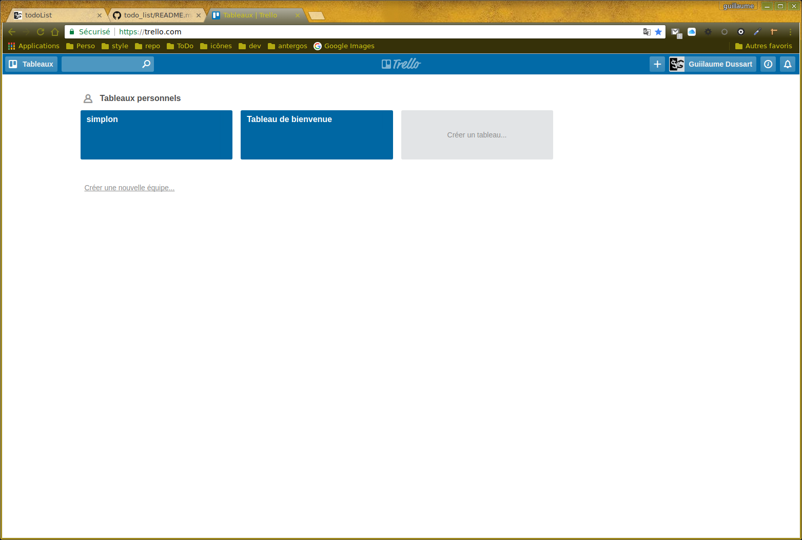

# todo_list  
De nombreux freelances travaillent avec des outils pour créer et organiser une to-do list. Et pour cause, cette méthode   présente un certain nombre d’avantages :  
  1. Vous libérez votre esprit, vous n’avez plus peur d’oublier.  
  2. Vous suivez l’avancement de vos travaux.  
  3. Vous avez l’impression d’accomplir des choses, d’atteindre vos objectifs et d’être efficace (des petites victoires bonnes pour le moral).  
  4. Pour bénéficier de tous les avantages d’une to-do list, voici une sélection d’outils fort utiles pour organiser vos tâches. 
  
  
